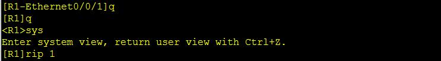
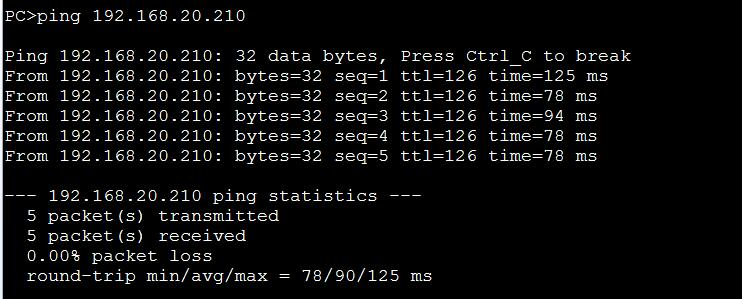

#### 计算机网络折腾计
> 生命在于折腾
<!--more-->
##### 一、工具准备
> ensp模拟器，wireshark
> 难点：路由器的设置和网络地址

##### 二、连接设备

##### 三、R的配置(
设备开启后操作)
    [HUAWEI] sys            //打开设置权限
    [HUAWEI] sysname R1         //重命名
    [R1] interface e0/0/0          //配置端口e0/0/0
    [R1] ip add xxx.xxx.xxx.xxx xx;      //设置端口的地址,格式为ip地址 掩码
    [R1] q       //退出端口设置
    [R1] rip         //rip协议网络设置
    [R1] network xxx.xxx.xxx.0        //设置网络地址
    [R1] q         //关闭路由器设置
    [R1] save all          //保存设置

###### 
图图来了（R1的配置）

> R2的配置

##### 四、ping ip地址
> PC1 ping PC3
> 

<a href="img/ensp.rar" >文件下载</a>