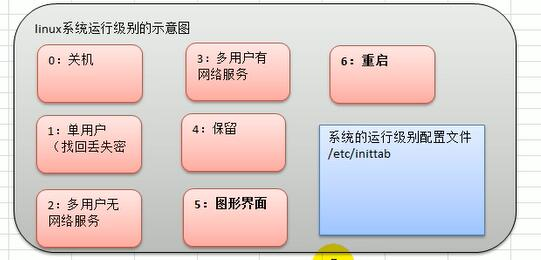

## linux实操篇
### 一、xshell(远程登录linux操作系统)
    用法：
### 二、xftp5(远程上传，下载)
### <h2 style="color:red">三、Vi、vim的使用（类似于Windows的记事本）（略） 
### 四、关机重启注销（略）</h2>
### 五、用户管理
- 添加用户
        useradd [option] hostname     //添加用户
        useradd -d /home/ltc ltc      //指定(自动)目录添加用户
        passwd ltc                    //更改用户密码
- 删除用户
        userdel ltc                   //保留家目录式删除用户
        userdel -r ltc                //删除家目录式删除
        
### 六、使用指令
#### 运行级别
<b>级别设置原因</b>：为了在一些领域或某些用户而设置的权限大小

> 指令级别图示

> 切换命令

        # init [0123456]
> 找回root密码 
> 进入单用户模式（进入此模式不需要密码），直接passwd修改命令

##### 帮助指令（man [指令]）
##### 文件目录类
1.pwd (print working directary) 
2.ls (默认 -a:包括隐藏文件  -l:以列表方式显示) 
3.mkdir  (mkdir -p /home/demo/rs     --创建多级目录)   
4.rm [-r,-f] filename  
5.touch(某人说了句“摸一下”)  
6.cp (copy) 

        # cp a.md b/      //copy a.md to b
        # cp -r test/ b/   //复制目录到目录，-r是递归作用

7.mv () 

        # mv oldnamefile newnamefile   //重命令
        # mv file newfile        //移动命令

8.查找 

        # cat -n FileName | more
        # cat -n FileName
        # more FileName
        # less FileName

9、重新定向（覆盖） 

        * >
        # ls -l > a.txt      //磁盘信息文件覆盖
        # cat a.txt > b.txt    //文件a复制到文件b 

10、追加（尾部）

        * >>
        # ls -l >> a.txt     //磁盘信息文件追加
        # cat a.txt >> b.txt   //文件追加
        # echo "hello world!" >> c.txt   //文件内容追加

11、echo、head、tail
- cho（在终端上显示内容）

        echo $PATH      //显示环境变量，大写PATH
        echo helloworld      //显示文本

- head（显示文件前面行内容）

        head -n 3 a.txt     //显示文件前三行内容

- tail（显示后面行内容）

        tail -2 b.txt         //显示后两行的内容
        tail -f b.txt         //监控文件是否有变化

11.ln指令 （软链接，类似Windows上的快捷方式)
        # ln -s [源文件或目录] [软链接名称]
        # ln -s /root fastcut      //创建软链接
        # rm -r fastcut            //删除软链接
12.history指令 （查看已执行的指令）
        # history       //显示所有历史指令
        # history 10    //显示指定数目的指令
        # ！200         //执行历史编号为200的指令
#### 时间日期类
1.date指令
        # date           //显示当前时间
        # date "+%Y-%m-%d %H:%M:%S"  //显示年月日
        
        # date -s "2019-1-5 10:15:22"  //设置时间
2.cal指令（显示日历时间）
        # cal            //当月的日历
        # cal 2019       //显示某年的日历
#### 搜索查找类
1.find指令(查找文件)
        # find 【查找的范围】 【按方式查】 [文件名称]
        # find /home -name new.txt    //查找文件
        # find /opt -user root     //查找用户的文件
        # find / -size +20M      //根目录下查找大于20M的文件
        # find / -name *.txt     //按通配符查找
        
2.locate指令（快速定位文件路径）
        # updatedb      //创建数据库（必须要做的）
        # locate hello.txt    //快速定位文件的目录
3.grep指令，管道符号 |
        # grep [-n<显示匹配行和行号> ,-i<忽略大小写>] 【关键字】 [源文件]
        # cat a.md | grep -ni hello  //查看文件并通过管道交给grep指令
